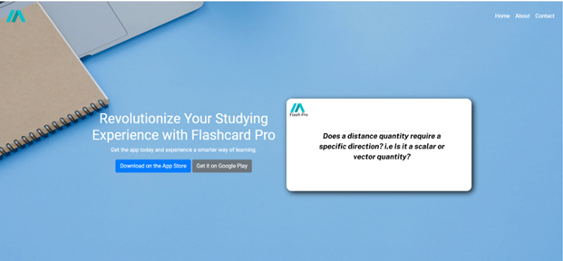
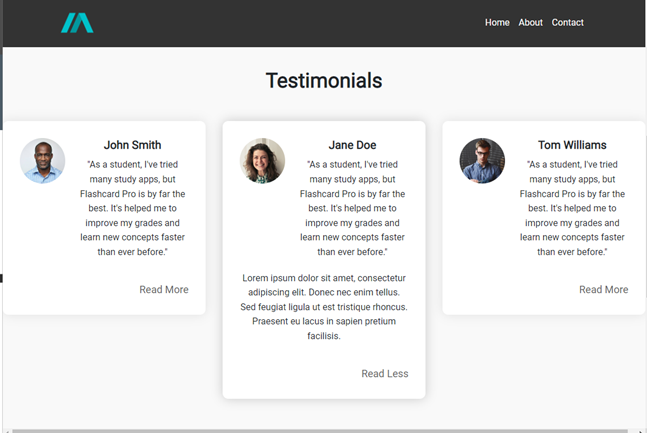
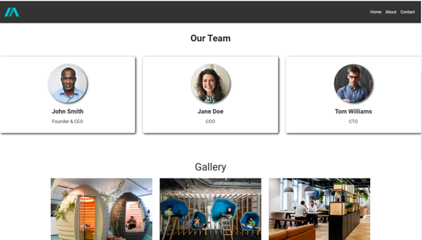
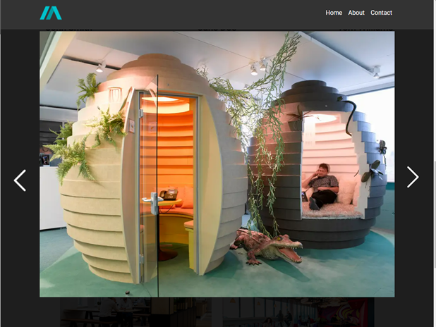
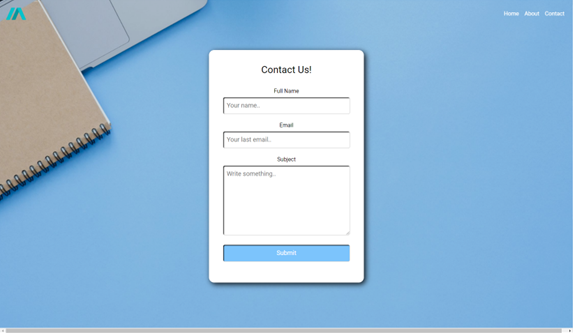

# Flashcards pro- By Zach delapenha

## CONTENTS

1. INTRODUCTION

2. MY SOLUTION

   - NAVIGATION
   - CONTACT FORM
   - HOME PAGE
   - PROJECTS PAGE
   - GALLERY PAGE
   - FOOTER

3. SUMMARY

## 1. INTRODUCTION

In this assignment, I was tasked to create a contemporary website using html, css and javascript.

I decided to build a marketing website for a company called Flash card pro, which is a company that has an app that helps people learn using flash cards.

### TEHCNOLOGIES USED

    - HTML
    - CSS
    - JAVASCRIPT
    - BOOTSTRAP
    - JQUERY

## 2. MY SOLUTION

### NAVIGATION


For the navigation bar I kept it simple, I used the bootstrap navbar component and added a logo and a hamburger menu for mobile devices.

### FOOTER

For the footer i designed a layout using bootstrap grid system, I used the 60-30-10 rule to create a balanced layout.

The footer contains links to download the app and contact information.

### HOME PAGE

#### HERO



The Hero section of the home page contains a hero image and a call to action button followed by an animation of a flash card which spins to show the answer to the question when hovered over.

I achieved this by using the bootstrap grid system and adding a class of `flip-card` to the div containing the flash card. I then used css to add the animation.

#### TESTIMONIALS



The testimonials section containts a 3x1 grid of testimonials, I used the bootstrap grid system to achieve this and then added read more functionality to each testimonial using javascript.

The javascript code is as follows:

    const readMoreButtons = document.querySelectorAll('.read-more');

    readMoreButtons.forEach((button) => {
    button.addEventListener('click', () => {
    event.preventDefault();
    const hiddenText = button.previousElementSibling;
    hiddenText.classList.toggle('hidden-text');
    button.textContent = hiddenText.classList.contains('hidden-text') ? 'Read More' : 'Read Less';
    });
    });

#### FEATURES

The features section contains a 3x1 grid of features, I used the bootstrap grid system to achieve this. It also shows an image of the app so the user can see what it looks like.

#### PRICING

This section contains a pricing table which shows the different pricing options for the app. It also has links to download the app.

### ABOUT PAGE

#### HERO


Similar to the home page hero, the about page hero contains a hero image and a short description of the company from the CEO.

#### MEET THE TEAM



The meet the team section contains a 3x1 grid of team members, I used the bootstrap grid system to achieve this.

#### GALLERY



The gallery page contains a 3x3 grid of images, I used the bootstrap grid system to achieve this. I also added a lightbox to the images so that when the user clicks on an image it opens in a lightbox. I achieved this with vanilla javascript.

The gallery.js file does the following:

first grabs all the relevant elements from the DOM and stores them in variables.
Then creates an array of image indexes.
Then declares a variable that will be used to store the current image index.
Creates two functions to handle the opening and closing of the lightbox. openPopup() and closePopup().
Creates a function that iterates through the image indexes and dynamically renders the images to the gallery page.
Creates a event listener that listens for a click event on the gallery images and when the image is clicked it opens the lightbox and displays the image in a larger size.
Creates two functions that handle the next and previous image buttons in the lightbox. showNextImage() and showPrevImage().
Creates a event listener that listens for a click event in the lightbox and when its triggered it closes the light box.

### CONTACT PAGE

#### CONTACT FORM

The contact page contains a contact form which allows the user to send a message to the company.

For the validation of the form i created my own custom validation using javascript. This validation uses regular expressions to check if the user has entered a valid email address and if the user has entered a message. The border surrounding the input fields turn red or green depending on if the users input matches the regular expression.

The form does not submit because its has been created to link to a backend system and this project is solely frontend. However, if the form was to submit it would send the data to the backend system and the backend system would then send an email to the company with the users message.



## 4. SUMMARY / REFERENCES

### SUMMARY

Overall this project was a great learning experience for me, I learnt a lot about html, css and javascript. I also learnt how to use bootstrap to quickly make responsive websites as i was time constrained.

If i had more time i would have liked to add more features to the website such as a click through user journey.

### REFERENCES

Brainscape (2022) Are flashcards effective? The top 3 ways they can boost your grades. Available at: https://www.brainscape.com/academy/are-flashcards-effective/ (Accessed at: 13th April 2023).

Google Fonts (2023) Roboto Font. Available at: https://fonts.google.com/specimen/Roboto (Accessed at: 13th April 2023).

Statistica (2023) Size of the global e-learning market in 2019 and 2026. Available at: https://www.statista.com/statistics/1130331/e-learning-market-size-segment-worldwide (Accessed at: 14th April 2023).

StuartMedia (2014) Should your mobile app have a website? Available at: https://stuartmedia.co.uk/should-your-mobile-app-have-a-website (Accessed at: 14th April 2023).

Continuing Professional Development Service (2020) What is Continuing Professional Development (CPD)? Available at: https://cpduk.co.uk/explained (Accessed at: 14th April 2023).

HubSpot (2022) 9 Guidelines & Best Practices for Exceptional Web Design and Usability. Available at: https://blog.hubspot.com/blog/tabid/6307/bid/30557/6-guidelines-for-exceptional-website-design-and-usability.aspx (Accessed at: 15th April 2023).

Harvard University (n.d.) Use images and media to enhance understanding. Available at: https://accessibility.huit.harvard.edu/use-images-and-media-enhance-understanding (Accessed at: 15th April 2023).

CampaignMonitor (2019) Interactive Elements That Can Increase User Engagement. Available at: https://www.campaignmonitor.com/blog/ecommerce/interactive-elements-that-can-increase-user-engagement/ (Accessed at: 16th April 2023).

Bootstrap (2023) Grid System. Available at: https://getbootstrap.com/docs/5.0/layout/grid/ (Accessed at: 16th April 2023).

Web.dev (2023) Loading Third-Party JavaScript. Available at: https://web.dev/optimizing-content-efficiency-loading-third-party-javascript/ (Accessed at: 17th April 2023).

UC Berkeley (n.d.) Top 10 Tips for Making Your Website Accessible. Available at: https://webaccess.berkeley.edu/resources/tips/web-accessibility (Accessed at: 17th April 2023).

MDN Web Docs (2023) <a>: The Anchor element. Available at: https://developer.mozilla.org/en-US/docs/Web/HTML/Element/a (Accessed at: 18th April 2023).

Cloudflare (n.d.) CDN Performance. Available at: https://www.cloudflare.com/learning/cdn/performance/ (Accessed at: 19th April 2023).

FlowMapp (n.d.) 60-30-10 Rule. Available at: https://www.flowmapp.com/blog/glossary-term/60-30-10-rule (Accessed at: 19th April 2023).

```

```
